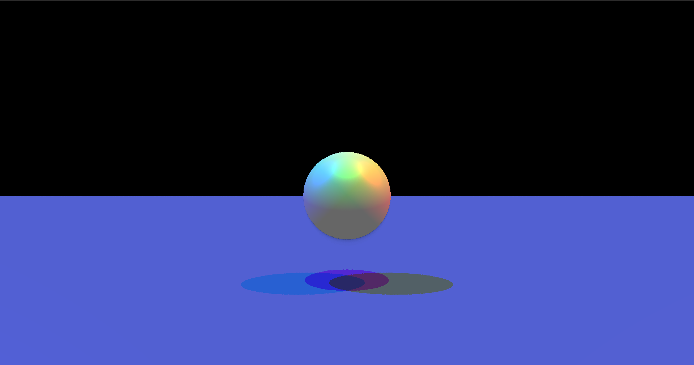
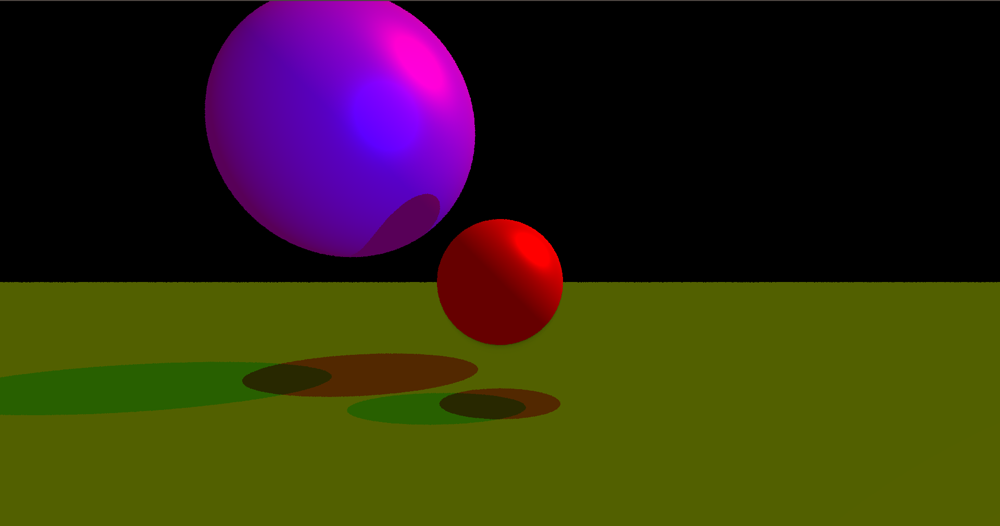

# arcade

This project is a C++ program whose goal was to be able to simulate the impact of light on primitives like sphere, cones, cylinders or planes. The lighting was made using the phong model.
The scene is made with a configuration file that specifies the rotation, position and color of each primitive.
There is no implementation yet of multithreading so the program might be slow.
Expect at least 40 seconds of loading

## Installation

### SFML installation

```
sudo apt-get install libsfml-dev
```
If this doesn't work, here's the [complete guide ](https://www.sfml-dev.org/tutorials/2.6/start-linux.php)


## Usage/Examples

### Create the binary
```bash
cd Raytracer
make
```


### Execute the binary
In order to execute the binary, you have to pass as an argument the path to a scene configuration file
```
./raytracer [PATH]

# exemple : ./raytracer configuration.scene
```

If you redirect the output to a file, it will automatically format it as a .ppm file
```
./raytracer [PATH]

# exemple : ./raytracer configuration.scene > output.ppm
```


## Authors

- [@501stEcho](https://github.com/501stEcho)
- [@agherasie](https://github.com/agherasie)
- [@Baragouin](https://github.com/Baragouin)


## Screenshots



